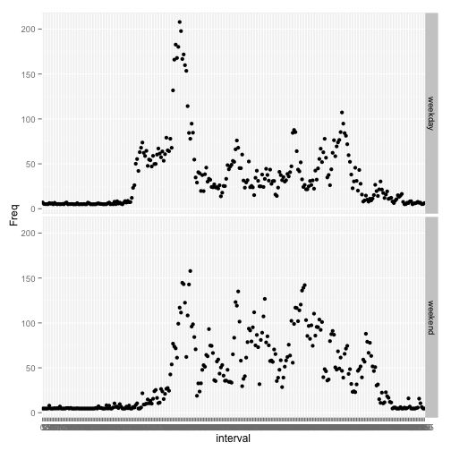

# Reproducible Research: Peer Assessment 1


## Loading and preprocessing the data

```r
setwd("/Users/pankajkataria7/Desktop/Coursera/Data/ReproducibleResearch/PeerAssignment1")
unzip("./RepData_PeerAssessment1/activity.zip")
data <- read.csv("./RepData_PeerAssessment1/activity.csv")
data$date = as.Date(data$date, "%Y-%m-%d")
summary(data)
```

```
##      steps            date               interval   
##  Min.   :  0.0   Min.   :2012-10-01   Min.   :   0  
##  1st Qu.:  0.0   1st Qu.:2012-10-16   1st Qu.: 589  
##  Median :  0.0   Median :2012-10-31   Median :1178  
##  Mean   : 37.4   Mean   :2012-10-31   Mean   :1178  
##  3rd Qu.: 12.0   3rd Qu.:2012-11-15   3rd Qu.:1766  
##  Max.   :806.0   Max.   :2012-11-30   Max.   :2355  
##  NA's   :2304
```

## What is mean total number of steps taken per day?

```r
stepsDay <- aggregate(steps ~ date, data = data, sum, na.rm = TRUE)
head(stepsDay)
```

```
##         date steps
## 1 2012-10-02   126
## 2 2012-10-03 11352
## 3 2012-10-04 12116
## 4 2012-10-05 13294
## 5 2012-10-06 15420
## 6 2012-10-07 11015
```

```r
str(stepsDay)
```

```
## 'data.frame':	53 obs. of  2 variables:
##  $ date : Date, format: "2012-10-02" "2012-10-03" ...
##  $ steps: int  126 11352 12116 13294 15420 11015 12811 9900 10304 17382 ...
```

```r
hist(stepsDay$steps, xlab="Number of steps taken", main = "Histogram of the total number of steps taken each day")
```

 

```r
mean(stepsDay$steps)
```

```
## [1] 10766
```

```r
median(stepsDay$steps)
```

```
## [1] 10765
```

## What is the average daily activity pattern?

```r
stepsInterval <- aggregate(steps ~ interval, data = data, mean, na.rm = TRUE)
plot(steps ~ interval, data = stepsInterval, type = "l")
```

 

```r
stepsInterval[which.max(stepsInterval$steps), ]$interval
```

```
## [1] 835
```


## Imputing missing values

```r
sum(is.na(data$steps))
```

```
## [1] 2304
```

Replace missing step values with the mean for a given 5-minute interval across the entire observation period


```r
data$steps2 = data$steps
for (i in 1:length(data$steps)) if (is.na(data$steps[i])) {
    data$steps2[i] = mean(data$steps, na.rm = TRUE)
}
```

Create a new dataset that is equal to the original dataset but with the missing data filled in.


```r
dataNew = data.frame(steps = data$steps2, date = data$date, interval = data$interval)

stepsDayNew = aggregate(steps ~ date, data = dataNew, sum)

hist(stepsDayNew$steps)
```

 

```r
mean(stepsDayNew$steps, na.rm = TRUE)
```

```
## [1] 10766
```

```r
median(stepsDayNew$steps, na.rm = TRUE)
```

```
## [1] 10766
```
## Are there differences in activity patterns between weekdays and weekends?


```r
day = weekdays(dataNew$date)
dayType = vector()
for (item in day) {
    if (item == "Saturday" || item == "Sunday") {
        dayType = append(dayType, "weekend")
    } else {
        dayType = append(dayType, "weekday")
    }
}
dataNew$dayType = factor(dayType)

avgStepsNew = data.frame(xtabs(steps ~ interval + dayType, aggregate(steps ~ 
    interval + dayType, dataNew, mean)))

library(ggplot2)

qplot(interval, Freq, data = avgStepsNew, type = 'line', facets = dayType ~ .)
```

 
